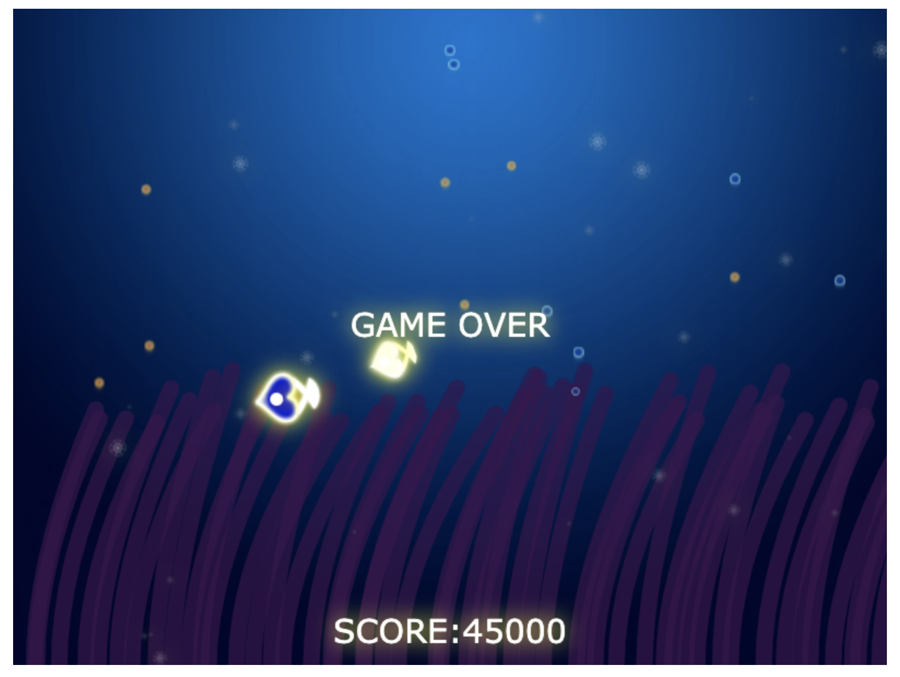

# 爱心鱼小游戏 
👉[DEMO]
(https://yaseminli.github.io/tinyheart/tinyHeart.html)单页面小游戏。鼠标控制大鱼吃浮动的果实，再喂养给小鱼来计分。通过鼠标跟随、碰撞检测、canvas绘制等来实现。

## Tips
### 海葵摆动
- 二次贝塞尔曲线：控制点和起始点不动，结束点做左右移动（正弦函数）

- 正弦函数：将正弦函数饿曲线图顺时针旋转90度就是一种左右摆动的效果